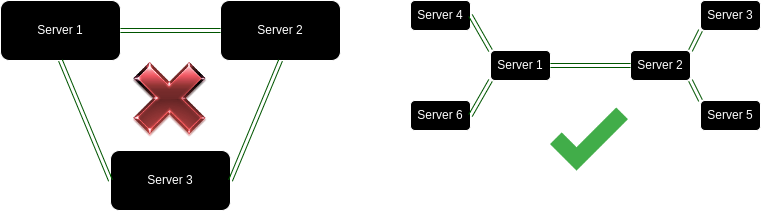

# IRC - Internet Relay Chat using Python

Internet Relay Chat (IRC) implementation in Python.

## How to Run

First, install the required packages:

```bash
pip install -r requirements.txt
```

Then, start the server using:

```bash
./start.sh
```
this command will start the default configuration 


if you want to start a custom configuration

To run a server

```bash
python3 server.py <server_port> <neighbor_port>
```
note that for the first server you dont neet to specify the neighbor port

To run a client

```bash
python3 userInterface.py <server_port> <nickname>
```

## Servers Architecture

- **No Loops**: Our configuration does not allow loops in the server's network.
- **Multiple Branches**: Capable of handling multiple branches of servers.
- **Server Linking**: Many servers can be linked to one another.
- **Client Capacity**: Each server can connect to one or many clients.


## Communication Strategies

### Messaging a User

To forward a message, we use a depth-first traversal of the network of the node in question.

#### Scenario 1: User in the Same Server

```
  Alice                  Server                               Bob
    |----------------------->|                                  |
    |      /msg bob hello    | (Bob is in the same server)      |
    |                        |--------------------------------->|
    |                        |            /msg Hello from alice |
    |                        |                                  |
```

#### Scenario 2: User in Different Server

```
  Alice          Server1             Server2         Server n    Bob
    |------------->|                    |                |         |
    |/msg bob hello|   /msg bob hello   | /msg bob hello |   hello |
    |              |------------------->|--------------->|-------->|
    |   True       |      True          |        True    |         |
    |<-------------|<-------------------|----------------|         |
    |              |                    |                |         |
                 bob is              bob is            bob is
                not here           not here             here
```

### Get the names


#### Scenario 1: Get all the names
```
  Alice  Server1             Server2                            Server n
    |        |                  |                                 |
    | /names |       /names     |                /names           |
    |------->|----------------->|-------------------------------->|
    |S1+S2+SN|       S2 +SN     |         Sn {server names}       |
    |<-------|<-----------------|<--------------------------------|
    |        |                  |                                 | 
```

#### Scenario 2: Get the names for a given channel
```
  Alice  Server1             Server2                            Server n
    |        |                  |                                 |
    |/names C|       /names C   |            /names C             |
    |------->|----------------->|-------------------------------->|
    |  data  |         data     |               data              |
    |<-------|<-----------------|<--------------------------------|
    |        |                  |                                 | 
            C is               C is                              C is
          not here           not here                            here

```

### Join a channel

#### Scenario 1: The channel exists in the client server

```
  Alice                                     Server1
    |                                        |
    |                /join C                 |
    |--------------------------------------->|   
    |              user added                |  Add the user to the channel
    |<---------------------------------------|
    |                                        |
```

#### Scenario 2: The channel exists in another server

 Alice  Server1             Server2                            Server n
    |        |                  |                                 |
    | /join C|        /join C   |             /join C             |
    |------->|----------------->|-------------------------------->|
    | added  |     user added   |            user added           |  Add the user to the channel
    |<-------|<-----------------|<--------------------------------|
    |        |                  |                                 | 
            C is               C is                              C is
          not here           not here                            here


#### Scenario 3: The channel dosent exist

 Alice  Server1             Server2                            Server n
    |        |                  |                                 |
    | /join C|        /join C   |             /join C             |
    |------->|----------------->|-------------------------------->|
    |        |       False      |              False              | 
    |        |<-----------------|<--------------------------------|
    |        |                  |                                 | 
    |        |Create the channel|                                 | 
    |        |and Add the user  |                                 |
    |        | to the channel   |                                 |
    | added  |                  |                                 | 
    |<-------|                  |                                 |
    |        |                  |                                 | 
            C is               C is                              C is
          not here           not here                          not here